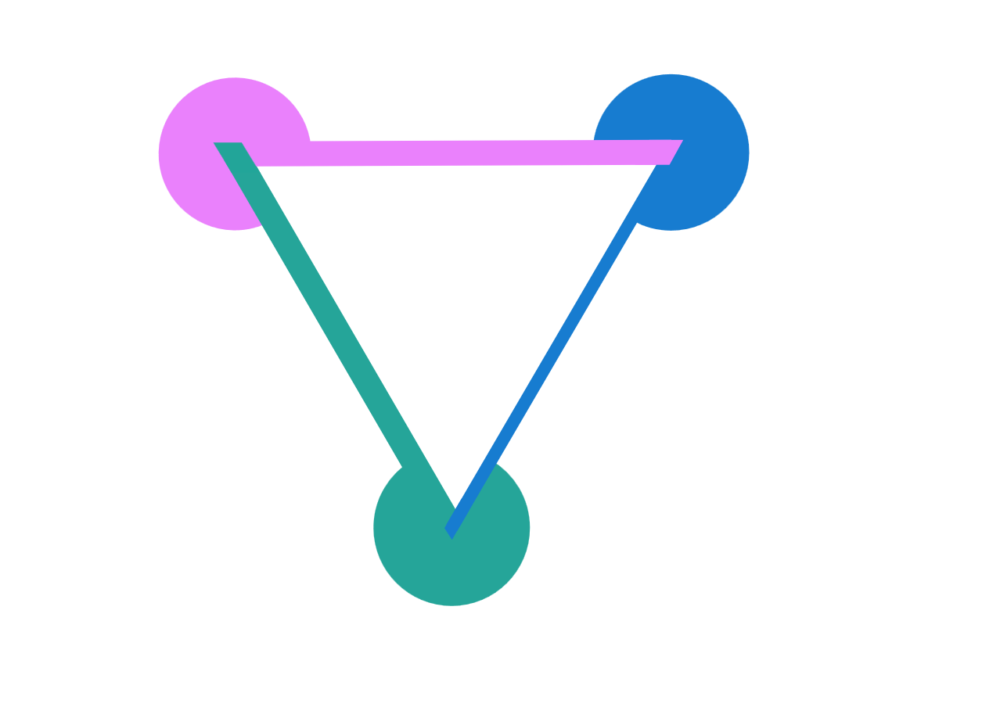

# Graphax
This package contains the implementation of the sparse cross-country elimination
method for Automatic Differentiation (AD).


## What the hell is Cross-Country Elimination?
Cross-country elimination is a automatic differentiation (AD) technique that
enables AD algorithm design with respect to relevant quantities such as 
computational and memory cost.
It allows for the design of tailored AD algorithms for a given function we wish
to differentiate.
`AlphaGrad` is an example of automated AD algorithm discovery using Reinforcement
Learning.

Another nice feature of cross-country elimination is that it can exploit the 
inherent static sparsity structure of Jacobians.


## Installation
The package requires has the following dependencies:
- jax
- numpy
- scipy
- matplotlib
The package itself is to be installed by running `pip install -e .` in the root 
directory.

## Usage
The package exposes a primitive called `jacve` which is the equivalent of 
`jax.jacfwd` and `jax.jacrev`. It provides an additional keyword `order` which 
is used to pass the elimination order for cross-country elimination.
It has two default modes `fwd` and `rev` which implement forward-mode and reverse-mode AD.
It is fully compatible with `jax.jit`, `jax.vmap` and even `jax.jacfwd` and `jax.jacrev`.
Example use that enables the use cross country elimination:
```graphax.jacve(f, order=[1,3,2,4], argnums=(0,1,2,3))(1., 1., 2., 7.)```.

## Projects using Graphax
- AlphaGrad
- Synaptax

